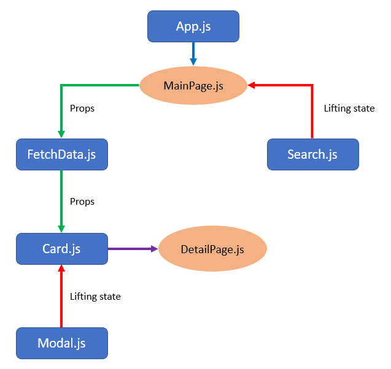

# GAProject2SGAttractions :earth_asia:

Explore the activities available in Singapore through the SGAttractions APP. Find out more about the activity and visit the place!

## Description

Explore SG attractions is an app for people to search for highlights of activities in SG and to learn more about those activities.

The app is limited in terms of its searches. The searches available are listed as follows (must be exact words):

- attractions
- venue
- shops
- accommodation
- cruises

## Technical Used

React, React Router Dom, [Material UI](https://mui.com/), JavaScript

## WireFrame/FlowChart

There is 4 components and 2 pages to the app. The app lifts the state with the search input form and sends the input down to the data fetching component before displaying the information on the main page. Upon selection of the activity to explore, it will redirect the users to the details page.

There is also an option to see the Modal which comprise of a state lifted to set open/close modal to true/false.

## User Stories

User must be able to:

- Search for the activities to learn what's available in SG.
- View the listed activities with their associated ratings to make an informed decision.
- Select the activity of interest to find out more information.

## Planning and development process

Wanted to create a search feature for users to be suggested activities to do in Singapore. With this in mind, an API that provides all SG activities was found. The API is explored and the information available for retrieval is noted. The last step is to display the information in the format I want.

## Problem solving strategies

The hardest part of the project is working with the images in the API. Trial and error was applied to explore which API link provides the information needed.

## Unsolved problems

Adding a modal feature to display information on the same page as well as a fixed list search feature.

## API used

[Tourism Information & Services Hub](https://tih-dev.stb.gov.sg/content-api/apis)

## Acknowledgements

Tourism Information & Services Hub, Material UI
